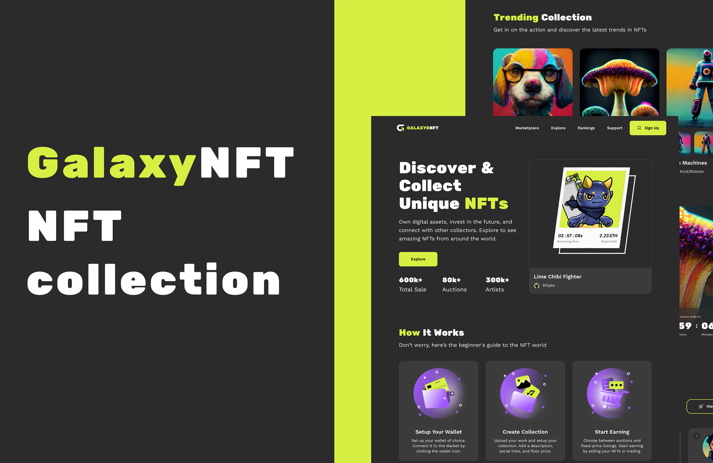

<div align="center">
<h1 align="center">🌌 GalaxyNFT – Responsive eCommerce NFT Website Template</h1>
GalaxyNFT is a fully responsive eCommerce NFT website template, designed to work seamlessly on all devices. Built with HTML, CSS, JavaScript, Bootstrap 5, and React + Vite, this template is optimized for performance, scalability, and a modern UI/UX.
<br />
<br />
<a href="https://galaxynft.pages.dev/"><strong>➥ Live Demo</strong></a>
<br />
</div>


## Demo




## programming language and tools

<p>
   <a href="#">
    
   </a>
</p>


## Pages

* 🏠 Home – Stunning landing page for NFTs
* 🛍 Marketplace – Browse and buy NFTs
* 🏆 User Rankings – Top NFT collectors & sellers
* 📞 Support – Help center for users
* 🖼 Product Page – Detailed NFT listing
* 👤 User Account – Personal dashboard for users
* 🏅 Member Account – Exclusive member access
* 🔑 Login – Secure authentication
* 📝 Signup – New user registration


## Features

<p>✅ Fully Responsive – Adapts to all screen sizes</p>
<p>✅ React + Vite – Fast and efficient development setup</p>
<p>✅ Bootstrap 5 – Modern and flexible UI components</p>
<p>✅ Dark Mode Support – Trendy and easy on the eyes</p>
<p>✅ Optimized Performance – Lightweight and fast loading</p>
<p>✅ Dynamic NFT Listings – Showcase NFT collections dynamically</p>


## Prerequisites

Before you begin, ensure you have met the following requirements:

- [Git](https://git-scm.com/downloads "Download Git") must be installed on your operating system.


## Installing GalaxyNFT

To install **GalaxyNFT**, follow these steps:

Windows:

```bash
git clone https://github.com/ahmed-abd-alalim/GalaxyNFT.git
cd GalaxyNFT
npm i
npm start
```


## Contact

<p align="left">
  <a href="https://www.linkedin.com/in/ahmed-abd-alalim-286768299/" target="_blank"></a>
</p>


## License

This program has been licensed under the MIT License. If you are a true FOSS (Free And Open Source Software) Lover, you wont customize this and redistribute this under your name
